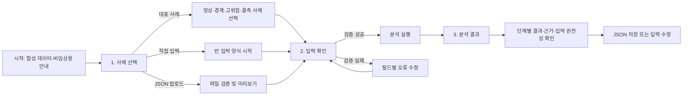

# PreCTG MVP 구현 및 수용 계획

이 문서는 PreCTG를 기능 시연 수준을 넘어 경진대회에서 안정적으로 설명·조작할 수 있는 완성도 높은 MVP로 구현하기 위한 작업 순서와 수용 기준을 정의합니다.

## 1. 목표 수준

PreCTG의 목표는 프로덕션 의료기기가 아니라 **완성도 높은 경진대회 시연용 애플리케이션**이다. 다음 세 조건을 동시에 만족해야 한다.

1. 기능: 합성 데이터 생성부터 단계별 분석, 결과 설명과 내보내기까지 전체 흐름이 실제로 동작한다.
2. 이해: 처음 보는 사용자가 별도 문서를 읽지 않고도 3단계 안에 결과에 도달하고 각 결과의 의미와 한계를 이해한다.
3. 신뢰: 누수·결측·모델 오류를 숨기지 않으며, 합성 데이터 결과를 실제 임상 성능처럼 표현하지 않는다.

일반적인 해커톤 MVP보다 높은 기준을 적용하되, 실제 진료, 병원 연동, 규제 대응과 운영 배포는 범위에 포함하지 않는다.

## 2. 사용자와 사용 환경

### 2.1 우선 사용자

- 1순위: 제안서와 데모를 평가하는 심사위원
- 2순위: 발표 중 PreCTG를 조작하는 팀원
- 3순위: 본선에서 실제 데이터로 파이프라인을 교체·검증할 개발자

### 2.2 기본 사용 환경

- 발표용 노트북의 데스크톱 브라우저
- 기본 화면폭 1280px 이상, 검증 화면폭 1280px·1024px·768px·390px
- 한국어 인터페이스와 Pretendard 글꼴
- 마우스와 키보드 사용
- 인터넷이 없는 로컬·폐쇄망 환경
- 한 번의 시연은 3분 이내

390px 화면은 핵심 발표 환경이 아니지만 텍스트·버튼이 겹치거나 기능을 사용할 수 없는 상태는 허용하지 않는다.

## 3. 제품 경험 원칙

### 3.1 한 화면에 하나의 주 행동

- 각 단계에는 강조된 주 버튼을 하나만 둔다.
- 주 버튼은 폼 또는 콘텐츠의 오른쪽 아래에 배치한다.
- `이전`, `입력 초기화`, `입력 수정` 등 보조 행동은 왼쪽 또는 주 버튼보다 낮은 강조도로 배치한다.
- 같은 의미의 버튼을 화면 위·아래에 중복하지 않는다.
- 비활성 버튼을 보여줄 때는 사용 불가 이유를 가까운 문장으로 설명한다.

### 3.2 사용자가 현재 위치를 잃지 않게 함

모든 주요 화면 상단에 다음 3단계 진행 상태를 표시한다.

```text
1. 사례 선택 → 2. 입력 확인 → 3. 분석 결과
```

현재 단계, 완료한 단계, 아직 진행하지 않은 단계를 색상뿐 아니라 번호와 문구로 구분한다. 뒤로 이동해 입력을 수정해도 사례와 입력 상태를 보존한다.

### 3.3 결과보다 근거를 먼저 이해하게 함

- 확률만 크게 노출하지 않는다.
- 위험 신호 수준, 단계별 변화, 주요 근거, 입력 완전성을 같은 시야 안에서 보여준다.
- 규칙 결과와 ML 결과를 서로 다른 제목과 영역으로 구분한다.
- `낮은 위험 신호`를 `안전`, `정상 확정`처럼 단정적으로 표현하지 않는다.
- 모델을 사용할 수 없으면 `분석 불가` 또는 `모델 결과 없음`을 표시하고 임의 확률을 생성하지 않는다.

### 3.4 오류를 복구 가능한 상태로 만듦

- 오류 메시지는 무엇이 잘못되었는지, 어느 입력을 어떻게 고칠지 함께 설명한다.
- 사용자가 입력한 정상 값은 오류 발생 후에도 유지한다.
- 전체 오류와 필드 오류를 구분한다.
- 파일 입력 오류는 파일명, 문제 필드와 지원 형식을 알려준다.
- 내부 예외·스택 트레이스·원본 페이로드를 사용자 화면에 노출하지 않는다.

## 4. 전체 사용자 흐름



필수 시연 경로는 `대표 사례 선택 → 입력 확인 → 분석 실행 → 결과 설명`이다. 직접 입력과 JSON 업로드는 같은 내부 스키마와 분석 엔진을 사용한다.

## 5. 화면별 명세

### 5.1 공통 셸

상단부터 다음 순서로 구성한다.

1. `PreCTG` 제품명과 한 줄 설명
2. 합성 데이터·비임상용 고정 안내
3. 3단계 진행 상태
4. 현재 단계 콘텐츠
5. 단계별 하단 행동 영역

공통 안내는 매 화면에서 찾을 수 있어야 하지만 입력을 방해할 정도로 높게 차지하지 않는다. 결과 화면에서는 안내를 한 번 더 명확히 표시한다.

### 5.2 1단계: 사례 선택

#### 목적

사용자가 입력 방식과 시연할 사례를 빠르게 고른다.

#### 배치

- 상단: `어떤 방식으로 시작할까요?`
- 입력 방식: `대표 사례`, `직접 입력`, `JSON 업로드`를 같은 수준의 선택 항목으로 표시
- 대표 사례 선택 시: 정상·경계·고위험·결측 사례를 한 줄 또는 반응형 2열로 표시
- 각 사례에는 이름, 한 줄 설명, 예상되는 입력 특징만 표시
- 하단 왼쪽: `입력 초기화`
- 하단 오른쪽 주 버튼: `입력 확인`

#### 수용 기준

- 기본 선택은 대표 사례의 정상 사례다.
- 사례 선택 시 페이지 전체를 새로 구성하지 않고 선택 상태와 한 줄 요약만 즉시 갱신한다.
- JSON 업로드 전에는 실제 환자정보를 넣지 말라는 안내를 파일 선택기 가까이에 표시한다.
- 잘못된 JSON은 분석 화면으로 넘어가지 않고 수정 가능한 오류를 표시한다.

### 5.3 2단계: 입력 확인

#### 목적

분석에 사용될 산모·임신 정보와 초기 CTG 정보를 이해하고 수정한다.

#### 배치

- 상단: 사례명, 입력 출처와 입력 완전성 요약
- 데스크톱: 왼쪽 `분만 전 정보`, 오른쪽 `초기 CTG 정보` 2열
- 768px 이하: 분만 전 정보 다음에 초기 CTG 정보를 세로 배치
- 자주 확인하는 핵심 필드는 기본 노출
- 식별자·원본 코드·생성 메타데이터는 `세부 정보` 안에 배치하고 기본 화면을 복잡하게 만들지 않음
- 각 입력은 한국어 라벨, 단위, 필요한 경우 짧은 도움말 제공
- 하단 왼쪽: `이전`
- 하단 오른쪽 주 버튼: `분석 실행`

#### 입력 원칙

- 체크박스·선택 목록은 AIHub 코드가 아니라 사람이 이해하는 한국어로 표시한다.
- 원본 코드값은 도움말 또는 세부 정보에서 확인할 수 있게 한다.
- `9999`는 숫자로 표시하지 않고 `알 수 없음`으로 표현한다.
- 필수값과 선택값을 구분하되 모든 라벨에 별표를 반복하지 않는다.
- 범위 오류는 입력 필드 가까이에서 즉시 안내한다.

#### 수용 기준

- 사용자는 스크롤 중에도 현재 사례와 단계가 무엇인지 알 수 있다.
- 오류가 있는 첫 필드까지 쉽게 이동하거나 화면 상단 오류 요약에서 해당 항목을 찾을 수 있다.
- 분석 실행 전 실제 모델에 전달될 필드와 제외되는 메타데이터를 확인할 수 있다.
- 분석 버튼을 연속 클릭해도 중복 실행되지 않는다.

### 5.4 3단계: 분석 결과

#### 목적

단계별 정보가 위험 신호 판단에 어떻게 반영됐는지 한눈에 설명한다.

#### 정보 우선순위

1. 통합 위험 신호 수준과 분석 가능 상태
2. 0단계·1단계·2단계의 변화
3. 주요 근거
4. 입력 완전성과 누락 항목
5. 모델·스키마·합성 데이터 정보

#### 배치

- 첫 영역: 통합 결과 제목, 위험 신호 수준, 한 문장 요약
- 두 번째 영역: `분만 전 → 초기 CTG → ML 분석` 3단계 흐름
- 세 번째 영역 왼쪽: 단계별 상세 결과와 근거
- 세 번째 영역 오른쪽: 입력 완전성, 누락 항목, 모델 상태
- 마지막 영역: 합성 데이터·비임상용 안내와 기술 세부 정보
- 하단 왼쪽: `입력 수정`, `새 사례 분석`
- 하단 오른쪽: `결과 JSON 저장`

#### 결과 표현

- 내부 등급은 화면에서 다음 한국어로 표현한다.
  - `LOW`: 낮은 위험 신호
  - `WATCH`: 관찰 필요
  - `HIGH`: 높은 위험 신호
  - `URGENT_REVIEW`: 우선 검토 필요
- 등급은 색상과 문구를 함께 사용한다.
- 확률은 소수점 한 자리 백분율로 표시하되 합성 모델 결과임을 같은 영역에 명시한다.
- 규칙 근거는 최대 3개를 우선 표시하고 나머지는 `전체 근거 보기`에서 제공한다.
- 입력 완전성은 ML 확신도와 별개로 표시한다.

#### 수용 기준

- 첫 화면에서 스크롤 없이 통합 결과, 3단계 변화와 주요 근거를 확인할 수 있다.
- 규칙 결과와 ML 결과의 출처를 혼동할 수 있는 문구가 없다.
- 모델이 없거나 호환되지 않을 때 규칙 결과는 유지되고 ML 영역은 `모델 결과 없음`으로 표시된다.
- 입력이 부족할 때 확률 대신 `입력 정보 부족`을 우선 표시한다.
- 저장한 JSON과 화면 결과의 필드 의미와 값이 일치한다.

## 6. UI 기준

### 6.1 레이아웃과 간격

- 콘텐츠 최대폭은 약 1120px로 제한해 긴 문장의 가독성을 유지한다.
- 기본 간격 체계는 4·8·12·16·24·32px을 사용한다.
- 카드나 테두리는 정보 묶음이 실제로 필요할 때만 사용한다.
- 모든 항목을 카드로 감싸거나 장식용 그라데이션·그림자·애니메이션을 사용하지 않는다.
- 결과의 중요도는 크기, 위치와 여백으로 먼저 표현하고 색상은 보조로 사용한다.

### 6.2 글꼴과 문장 가독성

- Pretendard를 로컬 자산으로 불러오고 한국어 시스템 산세리프를 대체 글꼴로 둔다.
- 본문 기본 크기는 16px 이상, 보조 문구는 13px 이상을 유지한다.
- 본문 줄높이는 1.5 이상으로 유지한다.
- 한 문단은 3문장을 넘기지 않고 긴 설명은 목록이나 도움말로 나눈다.
- 한 줄에 너무 긴 문장이 이어지지 않도록 텍스트 영역 폭을 제한한다.
- 영어 필드명과 코드값은 일반 사용자 화면의 주 제목으로 쓰지 않는다.

### 6.3 색상과 상태

- 기본 화면은 중립색을 중심으로 구성한다.
- 위험 상태 색상은 일관되게 사용하고 문구·아이콘 또는 형태와 함께 표시한다.
- `LOW`도 초록색만으로 안전을 암시하지 않는다.
- 본문과 배경의 명도 대비는 WCAG AA 수준을 목표로 한다.
- 키보드 초점 표시를 제거하지 않는다.

### 6.4 반응형과 안정성

- 1280px·1024px에서는 핵심 결과를 첫 화면에서 확인할 수 있어야 한다.
- 768px 이하에서 2열을 1열로 전환하고 버튼은 의미 순서를 유지한 채 줄바꿈한다.
- 390px에서 가로 스크롤, 잘린 문장, 겹친 버튼이 없어야 한다.
- 로딩 중에는 레이아웃이 크게 움직이지 않게 분석 영역의 상태를 명확히 표시한다.

## 7. 문체와 용어

### 7.1 기본 문체

- 짧고 자연스러운 존댓말을 사용한다.
- 사용자 행동을 직접 안내한다: `입력값을 확인해 주세요.`
- 번역체와 불필요한 명사화를 피한다: `분석을 수행합니다`보다 `분석합니다`를 사용한다.
- `성공적으로`, `해당`, `진행을 실시합니다` 같은 불필요한 표현을 쓰지 않는다.
- 버튼은 동사 중심으로 작성한다: `분석 실행`, `입력 수정`, `결과 저장`.

### 7.2 금지하거나 주의할 표현

- 사용 금지: `안전합니다`, `정상입니다`, `응급입니다`, `진단 결과`, `치료 권고`
- 대체 표현: `낮은 위험 신호`, `높은 위험 신호`, `우선 검토 필요`, `분석 결과`, `판단 근거`
- `신뢰도`는 모델 확신도와 입력 완전성을 혼동할 수 있으므로 단독 사용하지 않는다.
- 합성 데이터 확률은 `실제 발생 확률`로 표현하지 않는다.

### 7.3 대표 문구

- 고정 안내: `합성 데이터 기반 기능 시연용 MVP이며 실제 진단·처치나 임상 성능 검증에 사용할 수 없습니다.`
- 입력 부족: `분석에 필요한 정보가 부족합니다. 표시된 입력값을 확인해 주세요.`
- 모델 없음: `규칙 기반 결과만 표시합니다. 사용할 수 있는 ML 모델이 없습니다.`
- 파일 오류: `JSON 구조를 확인해 주세요. 지원하지 않는 필드 또는 코드값이 있습니다.`
- 처리 중: `입력값을 확인하고 단계별 위험 신호를 분석하고 있습니다.`

## 8. 구현 단계와 품질 게이트

각 단계는 코드 작성이 아니라 아래 수용 기준을 모두 만족할 때 완료한다.

### Gate 0: 데이터 계약 동결

구현:

- AIHub 원본 필드와 내부 필드 매핑
- 필드 타입·코드·단위·결측·가용 시점
- `early-window-v1` 20분 관찰창과 `emergency-after-index-v1` 합성 목표
- 화면·CLI·JSON이 공유하는 `result-contract-v1`
- 사후·목표·생성 메타데이터 차단 목록
- 대표 fixture와 기대 결과

완료 기준:

- 모든 사용 후보 필드에 가용 시점이 있다.
- 알 수 없는 필드는 모델 입력에서 자동 거부된다.
- 스키마 문서와 Pydantic 계약이 자동 테스트로 일치한다.
- 임상 정의가 확인되지 않은 필드는 기본 규칙에서 사용하지 않는다.

### Gate 1: 입력과 정규화

구현:

- JSON·CSV·화면 입력을 하나의 내부 스키마로 변환
- AIHub 코드와 한국어 표시값 양방향 매핑
- 결측·범위·코드 검증

완료 기준:

- 정상·경계·잘못된 코드·필수값 누락 fixture가 모두 테스트된다.
- 같은 의미의 세 입력 방식이 동일한 내부 레코드를 만든다.
- 오류 메시지에 문제 필드와 수정 방법이 포함된다.
- 원본 입력을 변경하지 않고 정규화 결과를 별도로 생성한다.

### Gate 2: 합성 데이터 생성기

구현:

- `distribution`·`coverage` 프로필
- 조건부 분포와 시나리오
- 합성 라벨, 결측과 경계 사례
- 데이터 품질 보고서와 체크섬

완료 기준:

- 같은 시드·구성으로 같은 체크섬을 생성한다.
- 50,000건에서 스키마·논리 제약 위반이 0건이다.
- 공개 AIHub 목표 비율은 50,000건 생성 시 별도 합의가 없는 항목에서 ±1%p 안에 든다.
- 완전 중복 행은 0건이며 의도하지 않은 환자 식별자 중복이 없다.
- 정상·경계·고위험·결측·규칙 충돌 시나리오가 각각 최소 100건 포함된다.
- 생성 보고서에 프로필, 시드, 규칙 버전, 분포 차이와 한계가 기록된다.

### Gate 3: 0단계·1단계 규칙 엔진

구현:

- 분만 전 위험도 점수와 근거
- 초기 CTG 범주와 근거
- 충돌 우선순위와 입력 부족 상태

완료 기준:

- 승인된 규칙만 기본 실행 경로에 포함된다.
- 골든 케이스에서 기대 점수·범주·근거가 100% 일치한다.
- 규칙 결과의 모든 문장은 실제 적용된 입력과 규칙으로 역추적된다.
- 입력 부족과 규칙 미승인 상태를 정상 결과처럼 표시하지 않는다.

### Gate 4: LightGBM 학습·모델 계약

구현:

- Model A와 선택적 Model B 학습
- 환자 그룹 분할, 전처리 Pipeline과 모델 저장
- 모델 메타데이터·특성 계약·호환성 검사

완료 기준:

- 누수 특성을 추가한 테스트는 학습 전에 실패한다.
- 동일한 산모·태아 그룹이 학습·검증 세트에 동시에 존재하지 않는다.
- 동일 시드 재학습 결과가 정의된 수치 허용오차 안에서 재현된다.
- 저장 전후 단일 사례 예측값이 `1e-9` 이내에서 일치한다.
- 모델 파일·스키마·특성 계약 불일치를 모두 `unavailable` 상태로 처리한다.
- 합성 데이터 성능값은 품질 게이트로 사용하지 않고 디버깅 정보로만 기록한다.

### Gate 5: 통합 Risk Engine과 CLI

구현:

- 입력 검증부터 통합 결과까지 단일 함수
- 생성·학습·단일 예측·배치 예측 CLI
- JSON 결과 계약과 설명 생성

완료 기준:

- 대표 사례 전체가 한 명령으로 끝까지 실행된다.
- 정상·모델 없음·입력 부족·호환 오류 경로에 처리되지 않은 예외가 없다.
- CLI와 Python API가 같은 입력에 같은 결과를 반환한다.
- 규칙 결과, ML 결과와 입력 완전성 필드가 명확히 분리된다.
- 오류 출력에 실제 의료정보나 전체 입력 페이로드가 포함되지 않는다.

### Gate 6: Streamlit UX·UI

구현:

- 3단계 사용자 흐름
- 대표 사례·직접 입력·JSON 업로드
- 입력 검증, 단계별 결과와 JSON 저장
- Pretendard, 반응형 배치와 접근성 상태

완료 기준:

- 처음 보는 팀원이 설명 없이 대표 사례 결과까지 3분 안에 도달한다.
- 모든 필수 시연 경로가 키보드만으로 조작 가능하다.
- 1280px·1024px·768px·390px에서 겹침·잘림·가로 스크롤이 없다.
- 결과의 첫 화면에서 통합 상태, 단계 변화, 주요 근거와 데이터 완전성을 확인한다.
- 비활성·로딩·성공·입력 오류·모델 없음·입력 부족 상태를 모두 확인한다.
- 화면의 버튼명, 결과 용어와 JSON 의미가 일치한다.
- 브라우저 콘솔 오류가 없고 로컬 글꼴 실패 시 대체 글꼴로 읽을 수 있다.

### Gate 7: 시연·인수 준비

구현:

- 데모 시나리오와 발표 순서
- 캡처·벤치마크·검증 보고서
- 본선 실제 데이터 전환 체크리스트

완료 기준:

- 정상·고위험·결측 사례를 각각 중단 없이 시연한다.
- 다른 팀원 1명이 개발자 개입 없이 데모 시나리오를 완료한다.
- 오프라인 상태에서 앱 시작, 사례 분석과 결과 저장이 동작한다.
- 제안서에 넣는 모든 화면·수치·문구의 재현 절차가 기록된다.
- 실제 성능으로 오해할 수 있는 표현을 팀원 2인이 교차 검토한다.

## 9. 성능 기준

기준 환경의 CPU·메모리·운영체제와 Python 버전을 벤치마크 결과에 기록한다.

| 작업 | 목표 |
|---|---:|
| 50,000건 합성 데이터 생성과 기본 검증 | 60초 이내 |
| 50,000건 LightGBM 학습 | 5분 이내 |
| 50,000건 배치 추론 | 15초 이내 |
| 단일 사례 분석 | 앱 준비 후 1초 이내 |
| Streamlit 첫 화면 표시 | 로컬 실행 후 5초 이내 |

환경 차이로 목표를 넘으면 병목을 측정하고 결과와 원인을 기록한다. 검증 없이 목표 수치를 낮추거나 실패를 숨기지 않는다.
최종 완료 시에는 위 목표를 충족해야 하며, 환경상 불가능한 항목은 측정 근거와 완화 방안을 팀이 명시적으로 승인한 경우에만 예외로 남긴다.

## 10. 검증 매트릭스

| 영역 | 필수 검증 |
|---|---|
| 스키마 | 타입, 코드, 범위, 결측, 원본-내부 필드 매핑 |
| 누수 | 목표·사후·미상·생성 메타데이터 차단 |
| 합성 데이터 | 재현성, 분포, 논리, 중복, 시나리오 커버리지 |
| 규칙 | 정상·경계·충돌·입력 부족 골든 케이스 |
| 모델 | 그룹 분할, 저장·로드, 계약 불일치, 모델 없음 |
| 통합 | JSON·CSV·화면 입력의 결과 일치, 오류 복구 |
| UX | 첫 사용자 3분 경로, 뒤로 가기, 입력 보존, 중복 실행 방지 |
| UI | 화면폭 4종, 키보드, 대비, 글꼴, 로딩·오류·빈 상태 |
| 문구 | 자연스러운 한국어, 금지 표현, 합성 데이터 경고 |
| 보안·개인정보 | 실제 의료정보 미사용, 로그·오류·산출물 점검 |
| 오프라인 | 외부 CDN·API 없이 주요 흐름 실행 |

## 11. 최종 완료 기준선

PreCTG MVP는 다음 조건을 모두 만족할 때만 완료로 본다.

- Gate 0~7의 필수 완료 기준이 모두 충족된다.
- `pytest`, Ruff 검사·포맷, 지침 검증과 유지되는 모든 자동 검사가 통과한다.
- 알려진 처리되지 않은 예외, 죽은 버튼, 임시 문구와 가짜 데이터 반환이 없다.
- 대표 사례 4종과 주요 실패 상태의 화면 검증 기록이 있다.
- 50,000건 생성·학습·배치 추론 벤치마크가 재현된다.
- 화면·CLI·JSON에서 합성 데이터와 비임상용 경계가 일관된다.
- README의 설치·실행·데모 절차를 새 환경에서 따라 할 수 있다.
- 모델 카드, 합성 데이터 보고서, 벤치마크 결과와 데모 진행표가 준비된다.
- 실제 데이터로 교체할 입력 어댑터·재학습·검증 지점이 문서화된다.
- 다른 팀원이 개발자 도움 없이 대표 데모를 완료한다.

## 12. 구현 순서와 병렬 작업

필수 순서는 다음과 같다.

```text
Gate 0 → Gate 1 → Gate 2 → Gate 3 → Gate 4 → Gate 5 → Gate 6 → Gate 7
```

다음 작업은 선행 계약이 확정된 뒤 병렬로 진행할 수 있다.

- Gate 2의 데이터 품질 보고서와 Gate 3의 규칙 테스트 사례
- Gate 4의 모델 학습과 Gate 6의 정적 UI 컴포넌트
- Gate 5의 CLI 결과 계약과 Gate 6의 결과 화면 문구
- Gate 7의 데모 진행표와 본선 전환 체크리스트

UI는 정적 모형으로 먼저 검토할 수 있지만 실제 결과 계약 없이 임의 값을 박아 완성된 기능처럼 보이게 만들지 않는다.

## 13. 단계별 산출물

| Gate | 주요 산출물 |
|---|---|
| 0 | 필드 매핑, 시간 계약, fixture, 스키마 테스트 |
| 1 | Pydantic 모델, 입력 어댑터, 오류 문구 |
| 2 | 합성 생성기, 프로필 구성, 품질 보고서 |
| 3 | 규칙 엔진, 근거 객체, 골든 테스트 |
| 4 | 학습 Pipeline, 모델 번들, 모델 메타데이터 |
| 5 | Risk Engine, CLI, JSON 결과 계약 |
| 6 | Streamlit 3단계 UI, 반응형·접근성 검증 기록 |
| 7 | 데모 시나리오, 캡처, 벤치마크, 본선 전환 체크리스트 |

## 14. 미결정 사항 처리

임상 임계값과 공식 `Emergency` 매핑 등 `product-spec.md`의 미결정 사항은 임의로 확정하지 않는다. 초기 관찰창과 합성 전용 예측 목표는 `data-spec.md`의 버전 계약을 따른다. 미결정 사항이 필요한 Gate에서는 다음 중 하나로 처리한다.

1. 공식 설명서·가이드라인을 확인해 근거와 적용 범위를 기록하고 승인한다.
2. 합성 데이터 전용 가정으로 명확히 분리하고 화면·결과에서 임상 기준으로 표현하지 않는다.
3. 기능을 비활성 상태로 유지하고 어떤 정보가 있어야 구현할 수 있는지 표시한다.
